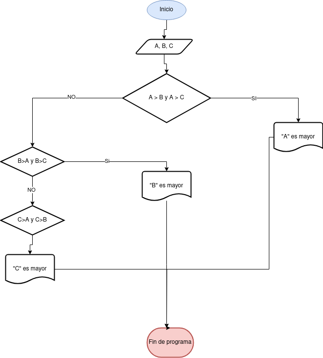

# Ejercicios

[Ejercicio 1](Ejercicio-1)

## Ejercicio 1:
### Diagrama de flujo
Desarolle un algoritmo que permita leer dos valores distintos,determinar cual de los mayor y escribirlo.

### Pseudocodigo
 Pasos:
- Inicio
- Inicializar variables:A=0 , B=0
- Solicitar la introduccion de dos calores distintos
- Leer los dos variables
- Asignar a las variables A y B
- __Si A=B Entonces vuelve a el inicio__ 
- __Si A>B entonces esbribir "A es el mayor"__ o de lo contrario __Escribir "B, es el mayor"__
- Fin

## Ejercicio 2
### Diagrama de flujo
Desarolle un algoritmo que permita leer 3 valores y almacenarlos en las variables A, B y c respectivamente. El algoritmo debe impirmir cuel es el mayo y cuel el menor. Recuerde contestar que los tres valores introducidos por el teclado sean valores distintos. Pressente un mensaje de alerta en caso de que se detecte la introduccion de valores iguales.

### Pseudocodigo
- Inicio
- Inicializarlas variables __A, B y C__
- Almacenar las variables en "A, B  y C"
- Si __A>B y A>C__ Escribir __"A es el mayor"__
- Si __B>A y B>C__ Escribir __"B es el mayor"__
- Si __C>A  yC>B__ Escribir __"C es el mayor"__
- Fin_Si
- Fin

## Ejercicio 3

Desarolle un algoritmo que realice la sumatoria de los numeros enteros comprendidos entre el 1 y el 10, es decir 1+1+2+3+....+10
