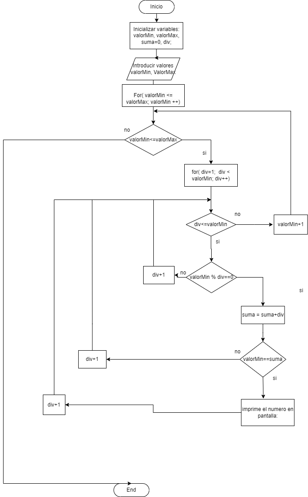
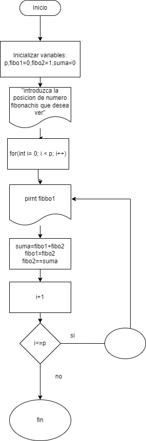

## Ejercicios
 
### Numeros perfectos

Encontrar y mostrar todos los números perfectos en un rango dado utilizando un bucle for. Solicita el límite por teclado

### diagrama de flujo

### Pseudocodigo

- Inicio
- Inicializamos la variables ("valorMin","valorMax","Suma=0" "div") 
- Pedimos el arco de valores que queremos comprobar si son o no perfectos
- Creamos un bucle for para que recorra desde el valor minimo hasta el valor maximo  de uno en uno 
- Dentro de ese bucle for creamos otros bucle for para los divisores, que iran desde 1 hasta el "valor min" menos -1 ya que un numero perfecto es la suma de todo sus divisores menos el mismo.
- Si el modulo entre el valor min y el div es =  0 hacemos la suma (suma=suma+div)
- Este proceso repetira hasta que el div sea -1 al valor minimo y hasta que el valor minimo sea igual que el valor maximo.
- Si la suma de sus divisores es igual que el valor minimo nos imprimira el numero en pantalla.
- Fin de programa 
 
### Dias de la semana

Imprimir el nombre del día de la semana correspondiente a un número ingresado por el usuario utilizando una estructura switch.
El día a verificar se debe de pedir por teclado.

### diagrama de flujo

### Pseudocodigo

- Inicio
- inicializamos la variable n
- pedimos por teclados el valor de n entre 1 y 7
- creamos un switch  con 7 casos ya que tenemos valores de 1 a 7
- en cada uno de esos caos asignamos que nos imprima un dia de la semana.
- fin
- si el valor introducido no coincide con ninguno de los casos propuestos, imprime una frase default
- fin
- fif_fin

###  Escribe un programa en Java que imprima el patrón siguiente:

1 

2 3 

4 5 6 

7 8 9 10 

### diagrama de flujo

### Pseudocodigo

- 

### Fibonachi 1

Escribe un programa en Java que imprima los primeros n términos de la secuencia de Fibonacci. Se debe solicitar el número n por teclado.

### diagrama de flujo

### Pseudocodigo

- inico
- inicializamos la variables fibo1=0, fibo2=1 ( ya que sabemos que los 2 primeros numeros fibonachis son 0 y1) "p" que es hasta la pocision que deseamos llegar y "suma=0"
- ingresamos el valor de p 
- inicializamos una variable (i=0) que ira aumentando +1 hasta llegar al valor de p
- si i <=p imprimiremos fibo1 luego haremos suma (suma=fibo1+fibo2, fibo1=fibblo2, fibo2=suma)
- repetiremos hasta que i=n
- fin 
 
### Fibonachi 2

Escribe un programa en Java que encuentre el número de Fibonacci en la posición n.  Se debe solicitar el número por teclado

### diagrama de flujo

### Pseudocodigo
- inico
- inicializamos la variables fibo1=0, fibo2=1 ( ya que sabemos que los 2 primeros numeros fibonachis son 0 y1) "p" que es hasta la pocision que deseamos llegar y "suma=0"
- ingresamos el valor de p 
- inicializamos una variable (i=1) que ira aumentando +1 hasta llegar al valor de "p"-1
- si "i" < "p" haremos haremos suma (suma=fibo1+fibo2, fibo1=fibblo2, fibo2=suma) 
- si i=n-1 imprime fibo1
- fin 

### MCD

Escribe un programa en Java que encuentre el máximo común divisor (MCD) de dos números. Se debe solicitar los números por teclado.

### diagrama de flujo

### Pseudocodigo

- Inicio
- Inicilalizamos variables num1, num2
- introducimos valor de las varibles 
- mientras num1 != num2 :
    - si num1 > num2 ; num1=num1-num2 si no; num1= num2-num1
- num1=num2 print el MCD es num1
- fin programa.

### Numeros Amstrong

Escribe un programa en Java que encuentre todos los números Armstrong entre 1 y 1000.

### diagrama de flujo

### Pseudocodigo

- Inicio
- inicializamos las variables u,d,c y suma
- creamos una variable i dentro de un bucle for que vale 1 y se incrementara ++1 hasta ser igual a mil (i<=1000;i++>)
- creamos una variable temporal(temp=1)
- comprobaremos si el numero es amstron con la si guiente fortmula
- primero necesitamos desglozar el numero en unidades decenas y centenas 
- u= temp%10 , d=temp%100/10, c=temp/100;
- suma= u*u*u+d*d*d+c*c*c
- si suma=temp entonces imprime ese numero en pantalla y repite el bucle hasta que i sea igual a 100
- fin 

### Suma de pares 

Calcular la suma de todos los números pares entre 1 y un número ingresado por el usuario utilizando un bucle do-while.

### diagrama de flujo

### Pseudocodigo

- inicio
- Inicializamos variables: valorMax, suma=0 i=2
- pedimos el valor tope
- haremos al menos una vez "do"  
- suma=suma+i; i+=;
- mientras (while) i<=valorMax
- si se cumple la condicion anterior: print la suma de numeros pares hasta "valorMAx" es "suma"
- fin.

### tabla multiplicar

Imprimir la tabla de multiplicar de un número ingresado por el usuario utilizando un bucle for. Solicita el valor de la tabla por teclado.

### diagrama de flujo

### Pseudocodigo
- Inicio
- inicializamos las variables valorMin, valorMax, n, multiplicar;
- introducimos el valor de las variables 
- bucle "for" donde creamos una variable "i" = "valorMin" que aumentara ++1 hasta que sea = a ValorMax
- si i<=valorMax; multiplicar= n*i, e imprime "n * i es igula a multiplicar" y lo hara hasta que la i sea igual a el valorMax
- fin

