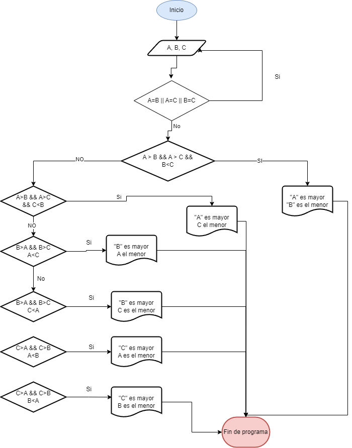

## Ejercicios
 
### Ejercicio 2
Desarrolle un algoritmo que permita leer tres valores y almacenarlos en las variables A, B y C
respectivamente. El algoritmo debe imprimir cual es el mayor y cual es el menor. Recuerde constatar que
los tres valores introducidos por el teclado sean valores distintos. Presente un mensaje de alerta en caso de
que se detecte la introducción de valores iguales.

### diagrama de flujo

### Pseudocodigo

- Inicio
  - Inicializar las variables A, B y C
  - Leer los tres valores
  - Almacenar en las variables A, B
     y C
  - Si A > B y A > C Entonces
  - Escribir A “Es el mayor”
  - Si B > A y B > C Entonces  escribir B “Es el mayor”
  - Sino  Escribir C “Es el mayor”
  - Fin_Si
  - Fin_Si
  - Fin+
### Ejercicio 3
Desarrolle un algoritmo que realice la sumatoria de los números enteros comprendidos entre el 1 y el 10, es decir, 1 + 2 + 3 + …. + 10. Utilia un buble __for__ y un bucle __while__.

### Diagrama de flujo.

